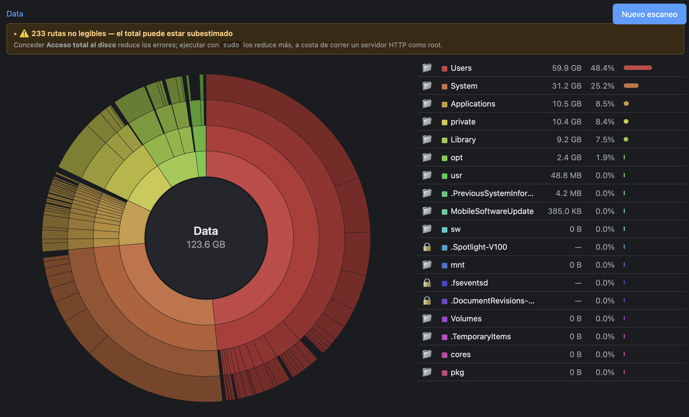

> La versión canónica es [README.md](README.md) (inglés). Esta traducción puede
> ir por detrás.

# escaner_disco

Un analizador de uso de disco local y de solo lectura para macOS, con un
gráfico sunburst navegable. Sin dependencias.

<!-- Captura pendiente de añadir por el autor; colócala en docs/screenshot.png -->


## Requisitos

- macOS.
- Python 3 (solo biblioteca estándar).
- Sin `pip`, sin `npm`, sin CDN. El frontend es HTML/CSS/JS vanilla y el
  sunburst se dibuja a mano con elementos `<path>` de SVG.

## Uso

Arranca el servidor local:

```bash
python3 server.py            # sirve en http://127.0.0.1:8765
```

Abre <http://127.0.0.1:8765>, escribe una ruta (por defecto
`/System/Volumes/Data`) o usa los accesos rápidos (`~`, `~/Downloads`,
`~/Library`) y pulsa **Escanear**. Páralo con `Ctrl-C` en la terminal donde
corre. El puerto es configurable: `python3 server.py --port 9000`.

También hay un modo CLI que imprime el top 20 y un resumen, o vuelca el árbol
completo como JSON:

```bash
python3 scanner.py /System/Volumes/Data
python3 scanner.py ~/Downloads --json tree.json
```

## Acceso total al disco

Para escanear fuera de tu carpeta de usuario, macOS exige **Acceso total al
disco** para la app desde la que lanzas el servidor, en:

> Ajustes del sistema → Privacidad y seguridad → Acceso total al disco

**Lánzalo desde Terminal (o iTerm), no desde tu editor.** En macOS los permisos
de privacidad (TCC) se heredan del proceso padre: el escaneo puede leer
exactamente lo que pueda leer la app que lo lanza. Si concedes Acceso total al
disco a la Terminal y arrancas `server.py` desde ahí, el servidor lo hereda; si
lo lanzas desde un editor sin ese permiso, verás muchas carpetas con candado
aunque el código sea idéntico.

Sin el permiso el escaneo no falla, pero muchas carpetas del sistema vuelven
como errores de permisos y el total sale corto. La app lo hace visible con un
banner de aviso bajo el breadcrumb; despliégalo para ver las rutas no legibles.

## Decisiones de diseño

**Tamaño real en disco (`st_blocks * 512`), no `st_size`.** Queremos el espacio
que un archivo ocupa de verdad —lo que se libera al borrarlo—, no su tamaño
lógico. `st_size` ignora la compresión de APFS y los archivos dispersos
(sparse), y no cuenta el redondeo al tamaño de bloque en archivos diminutos. La
contrapartida: los clones de APFS comparten sus bloques físicamente, pero aquí
se cuentan una vez por clon, así que los datos clonados se cuentan de más. `du`
usa bloques por el mismo motivo.

**Escanear `/System/Volumes/Data`, no `/`.** En APFS la raíz `/` es de solo
lectura y los datos del usuario viven en `/System/Volumes/Data`, montado sobre
`/` mediante firmlinks. Escanear `/` contaría las mismas rutas dos veces (una
por `/`, otra por el firmlink), así que cuando la raíz es `/` excluimos
`/System/Volumes/Data`. Como consecuencia, el total no es directamente
comparable con la cifra que muestra Ajustes del Sistema.

**Base 1000 (GB), no 1024 (GiB).** Los tamaños se formatean en base 1000 porque
es lo que muestra Finder en "Obtener información". Usar GiB haría que los
números no cuadraran con Finder y pareciera un error.

**`MAX_CHILDREN = 40`, podado al construir el árbol, no al servir.** Un disco
lleno tiene millones de nodos; guardar el árbol entero en RAM era caro y la
mayor parte son subárboles diminutos que nadie mira. Cada directorio conserva
solo sus 40 hijos mayores y el resto se colapsa en un único nodo sintético,
`"Otros (N elementos)"`. El `size` y `n_files` del padre se acumulan con *todos*
los hijos **antes** de podar, así que el total del escaneo nunca cambia. Subir
la constante exige reescanear, porque los subárboles descartados ya no están en
memoria.

**Qué significa una carpeta con candado.** Una carpeta con candado es un
directorio que no se pudo abrir (normalmente un error de permisos). Muestra un
guion, no `0 B` — `0 B` significaría "está vacía", y la verdad es "no he podido
mirar dentro". No se dibuja en el sunburst porque su tamaño es 0; darle un
mínimo artificial falsearía el gráfico. La lista y el banner son el canal para
esa información.

**Solo lectura, con un único efecto lateral deliberado.** Hasta ahora "solo
lectura" mezclaba dos ideas; a partir de S4 se separan. Primera: la app nunca
modifica el sistema de archivos. Eso sigue siendo absoluto, sin excepciones —
"Mostrar en Finder" lo respeta, porque `open -R` solo abre una ventana de Finder,
no cambia nada. Segunda: ningún endpoint tiene efectos laterales. Esa se rompe
exactamente una vez, a propósito, con `POST /api/reveal`, que abre Finder en una
ruta dada. Se considera seguro porque `open -R` no ejecuta nada (`open` a secas
lanzaría la app asociada al fichero; el flag `-R` solo lo revela), la ruta tiene
que ser un nodo que el último escaneo produjo de verdad (una ruta arbitraria del
sistema se rechaza con 404), y el endpoint es solo `POST` con comprobación de
`Origin`, así que una etiqueta `` perdida o una página de otro origen en
otra pestaña no pueden dispararlo. El resto de endpoints siguen siendo de solo
lectura.

## Rendimiento

Escaneo de referencia de `/System/Volumes/Data` en un volumen de prueba de
~1,2 M de archivos y ~123 GB de total, sin `sudo`:

| Métrica                         | S1     | S2         |
|---------------------------------|--------|------------|
| RSS máximo (`/usr/bin/time -l`) | 929 MB | **227 MB** |
| Tiempo de escaneo               | ~36 s  | ~35 s      |
| Total contabilizado             | ~123 GB | ~123 GB   |

La memoria bajó a aproximadamente un cuarto sin cambiar el total ni el tiempo.
El ahorro viene de podar a 40 hijos al escanear y de guardar solo el nombre de
la entrada en cada nodo, no de medir menos disco.

## Estructura del proyecto

```
escaner_disco/
├── scanner.py          # escáner de disco iterativo y de solo lectura (stdlib)
├── server.py           # servidor HTTP local, solo 127.0.0.1
├── static/
│   ├── index.html
│   ├── app.js          # sunburst, lista, breadcrumb, banner de errores
│   └── style.css
├── docs/               # especificaciones originales por sesión (en español)
├── LICENSE
├── README.md           # canónico, en inglés
└── README.es.md        # esta traducción
```

## Docs

`docs/` contiene las especificaciones originales por sesión (`PROMPT-S1.md`,
`PROMPT-S2.md`, `PROMPT-S3.md`), escritas en español. Registran cómo se
construyó el proyecto sesión a sesión.

## Licencia

MIT — ver [LICENSE](LICENSE).
