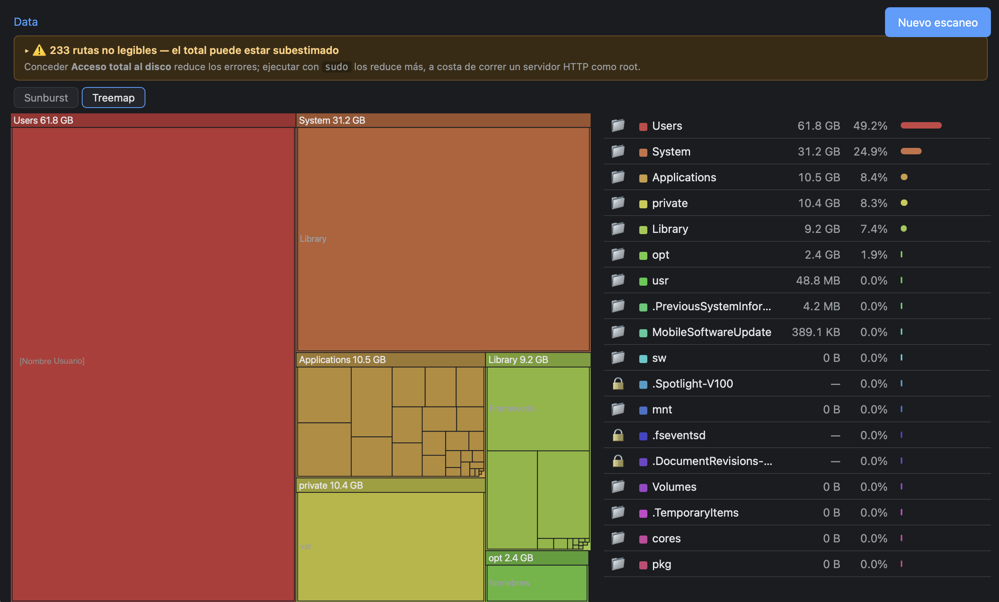

> La versión canónica es [README.md](README.md) (inglés). Esta traducción puede
> ir por detrás.

# escaner_disco

Un analizador de uso de disco local y de solo lectura para macOS, Windows y
Linux, con un gráfico navegable — se alterna entre una vista **sunburst** y una
**treemap** de los mismos datos. Sin dependencias.


*Vista sunburst, con el banner de rutas no legibles.*


*Vista treemap, anidada a dos niveles.*

## Requisitos

- macOS, Windows o Linux.
- Python 3 (solo biblioteca estándar; en Windows se usa `ctypes`, también stdlib).
- Sin `pip`, sin `npm`, sin CDN. El frontend es HTML/CSS/JS vanilla y el
  sunburst se dibuja a mano con elementos `<path>` de SVG.

## Compatibilidad de plataformas

El mismo `python3 server.py` corre en los tres sistemas. Todo lo específico de
un sistema operativo vive en un único módulo, `platform_support.py`.

| Función | macOS | Windows | Linux |
|---|---|---|---|
| Raíz por defecto | `/System/Volumes/Data` | unidad del sistema (`C:\`) | `/` |
| Accesos rápidos | Home, Downloads, `~/Library` | Home, Downloads, una por unidad fija | Home, Downloads |
| Tamaño real en disco | `st_blocks * 512` | `GetCompressedFileSizeW` (una llamada por fichero, ver abajo) | `st_blocks * 512` |
| Mostrar en el gestor | revela el fichero (Finder) | selecciona el fichero (Explorador) | abre el **directorio padre** (`xdg-open`) |
| Directorio de caché | `~/Library/Application Support/escaner_disco` | `%LOCALAPPDATA%\escaner_disco` | `$XDG_DATA_HOME` o `~/.local/share/escaner_disco` |
| Límite de volumen | `st_dev` | letra de unidad (`os.scandir` deja `st_dev` a 0) | `st_dev` |

Limitaciones conocidas:

- **Tamaño exacto en Windows.** La ocupación real usa `GetCompressedFileSizeW`,
  una llamada al sistema por fichero. Poniendo `WINDOWS_EXACT_SIZE = False` en
  `platform_support.py` se usa el `st_size` lógico y se ahorra la llamada.
- **El límite de volumen en Windows usa la letra de unidad.** `os.scandir`
  rellena el `stat` de cada hijo a partir del listado del directorio y deja
  `st_dev` a 0, así que el scanner compara la letra de unidad para decidir si un
  subdirectorio está en el mismo volumen (comparar el `st_dev` crudo descartaría
  *todos* los subdirectorios como "otro volumen" — el bug corregido en S8). Una
  consecuencia: un volumen montado en una carpeta (junction o punto de montaje
  NTFS a otra unidad) comparte la letra de unidad del padre y, si su `st_dev`
  también viene a 0, se escanea como si fuera parte de este volumen. Raro en
  equipos domésticos; la alternativa (un `os.stat` real por directorio) no
  compensa su coste.
- **Reveal en Linux.** No existe un "reveal" tipo `-R`; `xdg-open` sobre un
  fichero lo *abriría* con su aplicación asociada (lo que el endpoint de reveal
  prohíbe), así que en Linux se abre el directorio que lo contiene.
- **Las cachés no son portables entre sistemas.** Una caché guarda rutas,
  separadores y semántica de tamaño de un SO; se etiqueta con la plataforma que
  la escribió y se ignora al cargarla en otra.

## Uso

Arranca el servidor local:

```bash
python3 server.py            # sirve en http://127.0.0.1:8765
```

Abre <http://127.0.0.1:8765>, escribe una ruta (el valor por defecto y los
accesos rápidos se rellenan según el SO desde `/api/config`) y pulsa
**Escanear**. Páralo con `Ctrl-C` en la terminal donde corre. El puerto es
configurable: `python3 server.py --port 9000`.

Sobre el gráfico, dos pestañas alternan entre las vistas **Sunburst** y
**Treemap**. Al cambiar se conservan la carpeta actual, el breadcrumb, la lista
y el zoom — solo cambia el renderizador, y los colores se mantienen (lo que es
azul en una vista sigue siendo azul en la otra). La elección se recuerda entre
sesiones.

También hay un modo CLI que imprime el top 20 y un resumen, o vuelca el árbol
completo como JSON:

```bash
python3 scanner.py /System/Volumes/Data
python3 scanner.py ~/Downloads --json tree.json
```

## Permisos

Sin privilegios suficientes el escaneo **no** falla, pero muchas carpetas del
sistema vuelven como errores de permisos y el total sale corto. La app lo hace
visible con un banner de aviso bajo el breadcrumb; despliégalo para ver las
rutas no legibles. Cómo reducir esos errores depende del SO.

### macOS — Acceso total al disco

Para escanear fuera de tu carpeta de usuario, macOS exige **Acceso total al
disco** para la app desde la que lanzas el servidor, en:

> Ajustes del sistema → Privacidad y seguridad → Acceso total al disco

**Lánzalo desde Terminal (o iTerm), no desde tu editor.** En macOS los permisos
de privacidad (TCC) se heredan del proceso padre: el escaneo puede leer
exactamente lo que pueda leer la app que lo lanza. Si concedes Acceso total al
disco a la Terminal y arrancas `server.py` desde ahí, el servidor lo hereda; si
lo lanzas desde un editor sin ese permiso, verás muchas carpetas con candado
aunque el código sea idéntico.

### Windows — ejecutar como Administrador

Las zonas protegidas del sistema requieren un símbolo del sistema **elevado**.
Ábrelo con "Ejecutar como administrador" y luego `python server.py`. Ten en
cuenta que la caché vive en `%LOCALAPPDATA%`, dentro de tu perfil de usuario: en
NTFS el `chmod 0600/0700` POSIX que aplica la app es casi un no-op, y la
protección real es esa ubicación, no el modo del fichero.

### Linux — privilegios suficientes

Para leer rutas que no son tuyas, ejecuta con privilegios suficientes (p. ej.
`sudo`), a costa de correr un servidor HTTP local como root. `/proc`, `/sys`,
`/dev` y `/run` se omiten por ser pseudo-sistemas de ficheros.
`/var/lib/docker/overlay2` **no** se omite y puede inflar el total, porque las
capas de los contenedores comparten ficheros que se cuentan bajo varios
overlays.

## Caché

Tras cada escaneo con éxito, el árbol se cachea a disco para no esperar ~35 s en
cada arranque. La caché vive en el directorio **propio** de la app (según el SO
— ver la tabla de compatibilidad), nunca dentro del proyecto, porque un fichero
de caché es un mapa completo de los nombres de tus carpetas. Los ficheros se
crean con `0600` y el directorio con `0700` (en Windows/NTFS esos modos apenas
aplican; ahí la protección es vivir dentro de `%LOCALAPPDATA%`). Cada caché se
etiqueta con la plataforma que la escribió y se ignora al cargarla en otro SO —
una caché de macOS no describe un disco de Windows.

El formato es json + gzip, ambos de stdlib. **Nunca pickle:** deserializar
pickle ejecuta código, y esta herramienta no puede asumir ese riesgo ni siquiera
en un fichero propio. Hay un fichero por ruta escaneada, nombrado por un hash de
la ruta (la ruta original va dentro), así que varias cachés conviven. Un escaneo
de 1,2 M de nodos comprime a ~3 MB.

La caché **no se invalida sola.** Cuando el árbol activo viene de caché, la app
muestra cuándo se tomó (`Datos del 6 ago, 20:47 · Rescanear`) en vez de fingir
que es fresco — tú decides si conservarlo o reescanear. Subir `MAX_CHILDREN`
invalida las cachés existentes: un fichero generado con otro tope se ignora al
cargar (con un aviso), porque la poda ocurre al escanear.

Lo respaldan tres endpoints: `GET /api/cache` lista los escaneos guardados,
`POST /api/cache/load` carga uno en memoria, `POST /api/cache/clear` borra todos
los ficheros de caché. Los dos POST llevan comprobación de `Origin` y son solo
`POST`, igual que `/api/reveal`; `clear` **no recibe ninguna ruta** (el cliente
dice "borra", no "borra esto") y solo borra `*.json.gz` dentro del directorio de
caché, fichero a fichero — nunca `shutil.rmtree`.

## Decisiones de diseño

**Todo el código específico del SO en un solo módulo.** Raíz por defecto,
accesos rápidos, exclusiones, tamaño en disco, comando de reveal y directorio de
caché difieren por sistema; `platform_support.py` es el único fichero que sabe
en qué SO corre (`scanner.py`, `server.py` y `cache.py` no contienen ningún
`sys.platform`). Un solo sitio que leer al portar, un solo sitio que cambiar, y
el resto del código se lee sin ramas de SO desperdigadas.

**Tamaño real en disco, no `st_size`.** Queremos el espacio que un archivo ocupa
de verdad —lo que se libera al borrarlo—, no su tamaño lógico. `st_size` ignora
la compresión y los archivos dispersos (sparse), y no cuenta el redondeo al
tamaño de bloque en archivos diminutos. En macOS y Linux es `st_blocks * 512`.
En Windows no existe `st_blocks`, así que se llama a `GetCompressedFileSizeW`
(vía `ctypes`) para obtener la ocupación real — la misma decisión de S1 (medir
ocupación, no tamaño lógico), mantenida coherente entre plataformas. Cuesta una
llamada al sistema por fichero; `WINDOWS_EXACT_SIZE = False` cambia esa precisión
por `st_size` sin llamada extra. La contrapartida en otros casos: los clones de
APFS comparten sus bloques físicamente, pero aquí se cuentan una vez por clon,
así que los datos clonados se cuentan de más. `du` usa bloques por el mismo
motivo.

**Escanear `/System/Volumes/Data`, no `/`.** En APFS la raíz `/` es de solo
lectura y los datos del usuario viven en `/System/Volumes/Data`, montado sobre
`/` mediante firmlinks. Escanear `/` contaría las mismas rutas dos veces (una
por `/`, otra por el firmlink), así que cuando la raíz es `/` excluimos
`/System/Volumes/Data`. Como consecuencia, el total no es directamente
comparable con la cifra que muestra Ajustes del Sistema.

**No cruzar límites de volumen — con la señal correcta según el SO.** Un disco
externo montado bajo el árbol escaneado no debe contarse en su total, así que el
scanner se niega a descender a un subdirectorio de otro volumen. En macOS y
Linux `st_dev` es la señal fiable. En Windows *no* lo es: `os.scandir` devuelve
los hijos con `st_dev == 0`, así que la comprobación se apoya en la letra de
unidad (`platform_support.same_volume`). Comparar el `st_dev` crudo hacía que
cada subdirectorio pareciera otro volumen, y el escaneo se detenía en silencio
en el primer nivel — un escaneo entero de `C:\Windows` devolviendo 22 ficheros y
ningún error (corregido en S8). Como un no-descenso silencioso es indistinguible
de un escaneo correcto de una carpeta plana pequeña, el scanner ahora también
avisa por stderr cuando una raíz tiene subdirectorios pero no se recorrió
ninguno.

**Base 1000 (GB), no 1024 (GiB).** Los tamaños se formatean en base 1000 porque
es lo que muestra Finder en "Obtener información". Usar GiB haría que los
números no cuadraran con Finder y pareciera un error.

**`MAX_CHILDREN = 40`, podado al construir el árbol, no al servir.** Un disco
lleno tiene millones de nodos; guardar el árbol entero en RAM era caro y la
mayor parte son subárboles diminutos que nadie mira. Cada directorio conserva
solo sus 40 hijos mayores y el resto se colapsa en un único nodo sintético,
`"Otros (N elementos)"`. El `size` y `n_files` del padre se acumulan con *todos*
los hijos **antes** de podar, así que el total del escaneo nunca cambia. Subir
la constante exige reescanear, porque los subárboles descartados ya no están en
memoria.

**Treemap: squarified, dos niveles.** El treemap es una alternativa al sunburst
sobre el mismo árbol, en pestañas y no en paralelo — en un portátil de 13" dos
gráficos simultáneos dejan cada uno demasiado pequeño para leerse. El algoritmo
es un treemap *squarified* (Bruls, Huizing & van Wijk), no slice-and-dice: con
40 hijos de tamaños muy dispares, slice-and-dice produce tiras de 2px ilegibles
e imposibles de clicar, mientras que squarify mantiene cada rectángulo cerca del
cuadrado. Anida **dos** niveles — los hijos directos con una cabecera, y sus
hijos dentro — y no más: ver los nietos es donde el treemap gana al sunburst (se
lee de un vistazo que el peso está en `Library/Caches/algo` sin bajar), pero un
tercer nivel sería confeti. Los umbrales lo mantienen honesto: un rectángulo de
nivel 1 de menos de 60×40px se pinta macizo en vez de subdividirse, nada con
menos de 3px de lado se dibuja, y el texto solo se pinta si cabe entero — sin
elipsis a mitad de palabra, el tooltip cuenta el resto.

**Qué significa una carpeta con candado.** Una carpeta con candado es un
directorio que no se pudo abrir (normalmente un error de permisos). Muestra un
guion, no `0 B` — `0 B` significaría "está vacía", y la verdad es "no he podido
mirar dentro". No se dibuja en ninguno de los dos gráficos porque su tamaño es
0: en el treemap, igual que en el sunburst, una carpeta ilegible tiene área cero
y simplemente no aparece; darle un mínimo artificial falsearía el gráfico. La
lista y el banner son el canal para esa información.

**Nunca toca tus ficheros; solo gestiona los suyos.** Hasta ahora "solo lectura"
mezclaba dos promesas. Primera: la app nunca modifica *tus* ficheros — absoluto,
sin excepciones. Lo que sí gestiona, desde S5, son **sus propios ficheros de
caché**, en su propio directorio, que ella creó; "no borra nada" y "no borra
nada tuyo" son promesas distintas, y la segunda es la que podemos cumplir.
`/api/cache/clear` solo borra los `*.json.gz` de la app, y nunca acepta una ruta
del cliente. Segunda: ningún endpoint tiene efectos laterales — rota a propósito
por `POST /api/reveal` (revela el elemento en el gestor de archivos del SO sin
lanzarlo, la ruta tiene que ser un nodo que el escaneo produjo, solo `POST` con
comprobación de `Origin`) y por los endpoints de caché. El resto de endpoints
siguen siendo de solo lectura.

## Rendimiento

Escaneo de referencia de `/System/Volumes/Data` en macOS, un volumen de prueba
de ~1,2 M de archivos y ~123 GB de total, sin `sudo`:

| Métrica                         | S1     | S2         |
|---------------------------------|--------|------------|
| RSS máximo (`/usr/bin/time -l`) | 929 MB | **227 MB** |
| Tiempo de escaneo               | ~36 s  | ~35 s      |
| Total contabilizado             | ~123 GB | ~123 GB   |

La memoria bajó a aproximadamente un cuarto sin cambiar el total ni el tiempo.
El ahorro viene de podar a 40 hijos al escanear y de guardar solo el nombre de
la entrada en cada nodo, no de medir menos disco.

## Estructura del proyecto

```
escaner_disco/
├── scanner.py          # escáner de disco iterativo y de solo lectura (stdlib)
├── platform_support.py # todo lo específico del SO (macOS/Windows/Linux)
├── server.py           # servidor HTTP local, solo 127.0.0.1
├── cache.py            # caché en disco (gzip+json) de los árboles escaneados
├── static/
│   ├── index.html
│   ├── app.js          # sunburst, treemap, lista, breadcrumb, banner, UI de caché
│   └── style.css
├── docs/               # especificaciones originales por sesión (en español)
├── LICENSE
├── README.md           # canónico, en inglés
└── README.es.md        # esta traducción
```

## Docs

`docs/` contiene las especificaciones originales por sesión (de `PROMPT-S1.md`
a `PROMPT-S7.md`), escritas en español. Registran cómo se construyó el proyecto
sesión a sesión.

## Licencia

MIT — ver [LICENSE](LICENSE).
